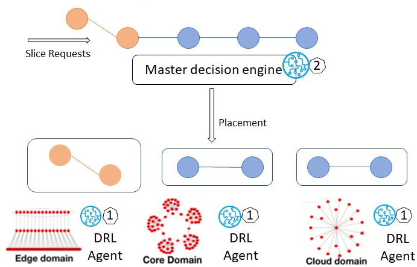
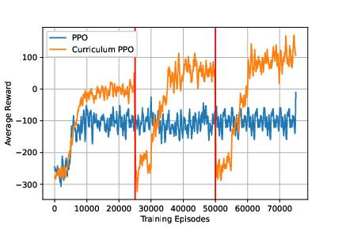
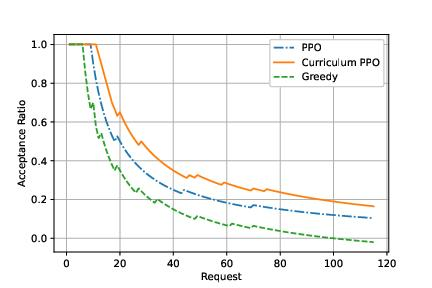
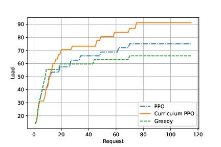

# Multi-domain Network Service Placement Optimization Using Curriculum Reinforcement Learning

This repository contains the code and core results for a research project exploring the use of curriculum reinforcement learning (RL) to optimize the placement of network services in a multi-domain environment. The project aims to maximize resource utilization (CPU, memory) and the number of accepted service requests while adhering to service level agreements (SLAs).

## Overview

This project is part of ongoing research in network slicing and resource orchestration.

- **Multi-domain Network Slicing:** The project addresses the challenge of placing network slices across multiple administrative domains, each with its own topology and resource constraints.
- **Curriculum Reinforcement Learning:** A hierarchical RL agent, trained with a curriculum learning approach, learns to efficiently place VNFs across multiple domains.
- **Resource Optimization:** The RL agent optimizes resource utilization (CPU, memory, bandwidth) to maximize the number of accepted service requests.
- **SLA Adherence:** The placement strategy considers end-to-end latency requirements to ensure SLA compliance.

## Repository Structure

```
configs/                # YAML configuration files for curriculum learning stages
    curriculum_stage1.yaml   # Configuration for simple slice requests
    curriculum_stage2.yaml   # Configuration for medium-difficulty slice requests
    curriculum_stage3.yaml   # Configuration for complex slice requests
figures/                # Project Figures
    env_master_AR.eps      # Acceptance ratio plot for the master agent
    env_master_load.eps    # Load plot for the master agent
    reward_1.eps           # Learning curves plot
training/               # Training scripts and related modules
    __init__.py.py
    callbacks.py.py        # Custom callbacks for logging metrics during training
    make_env.py.py         # Functions for creating the RL environment
    plot_utils.py.py       # Utility functions for plotting training metrics
    scheduler.py.py        # Curriculum scheduler for multi-stage training
    train_ppo.py.py        # Main training script for PPO with curriculum learning
requirements.txt        # Python dependencies
README.md               # Project documentation
setup.py                # Installation script
```

## Setup

### 1. Clone the Repository

```bash
git clone https://github.com/yourusername/multi-domain-CLRL.git
cd multi-domain-CLRL
```

### 2. Install Dependencies

```bash
pip install -r requirements.txt
```

### 3. Train the RL Agent

```bash
python training/train_ppo.py --configs configs/curriculum_stage1.yaml configs/curriculum_stage2.yaml configs/curriculum_stage3.yaml
```

## Key Results

The following figures summarize simulation results and provide insights into the performance of the curriculum RL approach.

### **Fig. 1: Multi-domain DRL Slice placement**

Shows the multi-domain DRL slice placement with vertical and horizontal training.

### **Fig. 3: A comparison of the learning curves using different training methods**

Shows the learning curves of a worker agent with PPO and Curriculum PPO, demonstrating the improved sample efficiency and final policy performance of curriculum learning. The red lines represent the switch from stage one to stage two and stage two to stage three in the curriculum.

### **Fig. 4: Performances over different algorithms for the acceptance ratio and the load**


Shows the performances over different algorithms (Curriculum PPO, PPO, Greedy) for the acceptance ratio and the load for the master agent, highlighting the superior performance of Curriculum PPO in maximizing acceptance ratio while efficiently utilizing resources.

## Citation

If you use this code in your research, please cite the following paper:

[Multi-domain Network Service Placement Optimization Using Curriculum Reinforcement Learning](https://ieeexplore.ieee.org/abstract/document/10329592/)

## License

This project is licensed under the MIT License. See the `LICENSE` file for details (create a LICENSE file).

## Acknowledgements

This research was supported by [Add any relevant funding sources or acknowledgements here].
